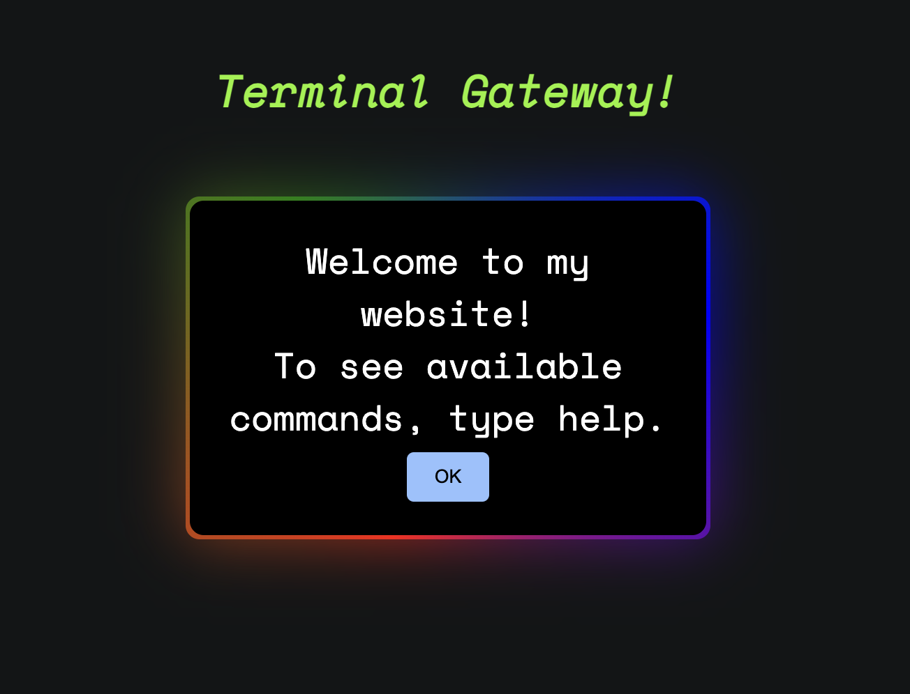

# Terminal Theme Web Page

Welcome to the Terminal Theme Web Page project! This web page emulates a terminal interface using HTML, CSS, and JavaScript. It features predefined commands and a classic terminal look, perfect for adding a retro feel to your web projects or for fun interactive experiences.

## Features

- **Terminal Emulation**: Experience a web page with a terminal-like interface.
- **Predefined Commands**: Enter predefined commands to see different responses.
- **Customizable**: Easily tweak the CSS and JavaScript to fit your needs.

## Screenshots



## Technologies Used

- **HTML**: Structure of the web page.
- **CSS**: Styling to give the page a terminal-like appearance.
- **JavaScript**: Handles command input and output.

## Installation

1. **Clone the Repository**

   ```bash
   git clone https://github.com/aditya06121/src-website.git
   ```

2. **Navigate to the Project Directory**

   ```bash
   cd src-website
   ```

3. **Open `index.html`**

   You can open the `index.html` file in any web browser to view the terminal theme web page.

## Usage

1. **Running the Web Page**

   Simply open `index.html` in your favorite web browser. You should see the welcome screen.

2. **Using Commands**

   Type any of the predefined commands into the terminal and press Enter. Here are some example commands:

   - `help`: Displays a list of available commands.
   - `about`: Shows information about the web page.
   - `clear`: Clears the terminal screen.

3. **Adding New Commands**

   To add new commands, modify the `commands.js` file. Each command is handled by a function in this file.

## File Structure

```
src-website
└──public
    ├── index.html   # Main HTML file
    ├── styles.css   # CSS file for styling
    └── script.js    # JavaScript file for terminal functionality
└── README.md        # This file
```

- `index.html`: Contains the structure of the terminal interface.
- `styles.css`: Provides styling to achieve the terminal look.
- `script.js`: Contains the logic for command handling and terminal interactions.

## Contributing

Contributions are welcome! Please fork the repository and submit a pull request with your changes. For major changes, please open an issue first to discuss what you would like to change.

## License

This project is licensed under the GNU License - see the [LICENSE](LICENSE) file for details.

## Contact

For any questions or inquiries, please contact [your.email@example.com](mailto:adityaraj7320@gmail.com).